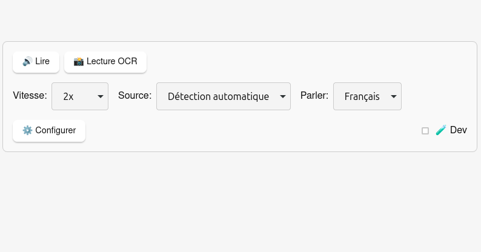

# gsp-ui

**Un lecteur d'écran accessible pour les personnes dyslexiques**

gsp-ui est une application de bureau open source qui convertit le texte en parole via une touche de raccourci global. Appuyez sur la touche, le texte du presse-papiers est lu à haute voix par eSpeak-NG directement sur votre ordinateur.

## 📸 Aperçu



## 📋 Prérequis

### Système
- **Linux (X11)** — l'application est actuellement compatible avec X11
- **eSpeak-NG** — synthèse vocale
- **PulseAudio** — système audio

### Installation des dépendances système

```bash
# Ubuntu/Debian
sudo apt-get install espeak-ng pulseaudio

# Fedora/RHEL
sudo dnf install espeak-ng pulseaudio

# Arch
sudo pacman -S espeak-ng pulseaudio
```

## 🚀 Installation et utilisation

### Utilisation de l'application compilée

1. Téléchargez la dernière version depuis les [Releases](https://github.com/upskaling/gsp-ui/releases)
2. Installez l'application selon votre plateforme
3. Lancez gsp-ui
4. Configurez votre touche de raccourci préférée
5. Copiez du texte et appuyez sur votre touche pour le faire lire

### Développement

#### Configuration

```bash
# Installez les dépendances
pnpm install
```

#### Commandes usuelles

```bash
# Démarrage en mode développement
pnpm dev

# Compilation pour la production
pnpm build

# Commandes Tauri directes
pnpm tauri build
```

#### Outils Rust

```bash
cd src-tauri

# Vérification du code
cargo check

# Formatage du code
cargo fmt

# Linting
cargo clippy

# Tests
cargo test
```

## 🤝 Contribution

Veuillez ouvrir une issue sur [GitHub Issues](https://github.com/upskaling/gsp-ui/issues).

---

Créé avec ❤️ pour l'accessibilité
